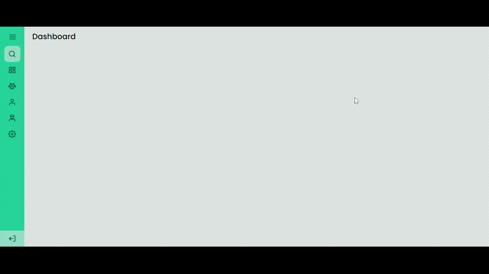

# 🚀 Projeto

- Projeto feito a partir de um dos desafios do discover na [Rocketseat](https://app.rocketseat.com.br/).
- [Desafio "Sidebar"](https://app.rocketseat.com.br/discover/challenges/theme-switcher). Consiste em uma Side bar responsiva.

# 🧪 Tecnologias

- HTML 5;
- CSS 3;
- JavaScript.

# 📽️ Preview

    

- Acesse a documentação [aqui](https://efficient-sloth-d85.notion.site/Desafio-Sidebar-f2251eb4976941eb958326ea327ffeb9).